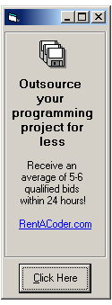



## oPicFlex Object:: A powerful, yet lightweight picture control\(ocx\)  W/ the following api ready featu

### Description

This is a picture control that I think most of you will like and (most ;~| ) all of you will appreciate. This picture object least importantly of all, displays a picture.

Here are some of its more powerful features: 1)Can display a picture from a file, just like a regular picture control, BUT can also, on the fly, instantly (without winsock or any other control) download a picture off the web and display it..so this control can dynamically display images that dont even reside on your machine 2) The control has a storedPicture object..which allows you to store an unlimited number of pictures for later use. simply call the AddToStoredPictures method. Display any one of the stored pictures, later, as the current picture by a call to oPicFlex.ActivePicture = 2 (or whatever index you specify) 3)The image displayed in this control automatically resizes as the control resizes (like the Image control)..buy only if the stretch property is set to True, like the Image control 4)A single call to this controls DrawFromThisBlt method acts as an internal replacement to the BitBlt, StretchBlt, and TransparentBlt api calls, so any part or all, of the controls current image can be painted to any other DC
 
### More Info
 

             |
---                |---
**Submitted On**   |2005-01-02 02:12:46
**By**             |[zoom2](https://github.com/Planet-Source-Code/PSCIndex/blob/master/ByAuthor/zoom2.md)
**Level**          |Intermediate
**User Rating**    |3.7 (56 globes from 15 users)
**Compatibility**  |VB 5\.0, VB 6\.0
**Category**       |[Custom Controls/ Forms/  Menus](https://github.com/Planet-Source-Code/PSCIndex/blob/master/ByCategory/custom-controls-forms-menus__1-4.md)
**World**          |[Visual Basic](https://github.com/Planet-Source-Code/PSCIndex/blob/master/ByWorld/visual-basic.md)
**Archive File**   |[oPicFlex\_O183558122005\.zip](https://github.com/Planet-Source-Code/zoom2-opicflex-object-a-powerful-yet-lightweight-picture-control-ocx-w-the-following-api-r__1-58047/archive/master.zip)

